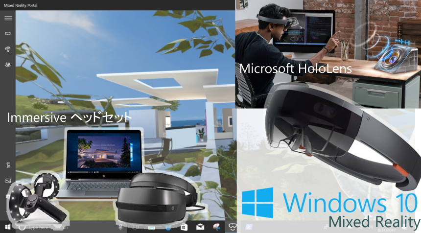

# Windows Mixed Reality の始め方

<strong>Windows Mixed Reality</strong> (以下「MR」) の始め方について、書いていけたらと思います。

#|記事|HoloLens|Immersive
---|---|----|----
01|MRヘッドセットを買ったら、まずやること|-|✔
02|[MRアプリ開発環境構築 (2017/12/23 時点)](https://github.com/chomado/WindowsMR_GettingStarted/blob/master/documents/02_InstallationChecklist.md)|✔|✔
03|Unity で Hello World|✔|✔

Pull Request 大歓迎！
