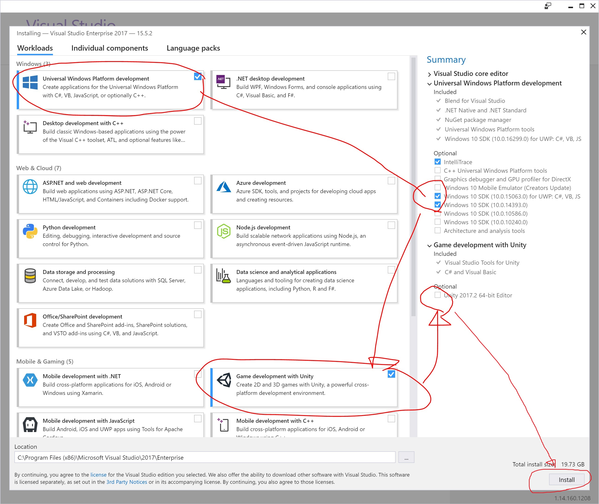

# 02. Windows Mixed Reality 対応アプリ開発環境構築 (2017/12/23時点)

基本的にはこちらに書いてあります    
[Installation checklist for HoloLens / immersive headsets ](https://developer.microsoft.com/ja-jp/windows/mixed-reality/install_the_tools)

現在 (2017/12/23時点) 英語のみなので、一応こちらにも載せます。

## 開発マシンのスペック

詳しい記事(公式)はこちら：     
* HoloLens: [hardware requirements for HoloLens Emulator ](https://developer.microsoft.com/en-us/windows/mixed-reality/install_the_tools#hololens_emulator) （英語）
* Immersive: [Windows Mixed Reality PC ハードウェア ガイドライン](https://support.microsoft.com/ja-jp/help/4039260/windows-10-mixed-reality-pc-hardware-guidelines) （日本語）

注意：

* `HoloLens アプリ開発用` の項目については、HoloLens エミュレータが動くスペックでご案内しています。
* `Immersive HMD 対応アプリ開発用` では「最小スペック」ではなく「推奨スペック」でご案内しています。  
* `Immersive HMD 対応アプリ開発用` の PC の方が求められるスペック大きいです。

#|HoloLens アプリ開発用|Immersive HMD 対応アプリ開発用|確認方法
----|----|----|----
OS|<ul><li>Windows 10 Fall Creators Update (2017/10/16 公開) 適用済 (つまり `16299.15` 以上)</li><li>Insider Preview はダメ</li><li>エディションは Windows 10 Pro 以上（Home エディションだと Hyper-V / HoloLens emulator サポートが無いため）</li></ul>|<ul><li>Windows 10 Fall Creators Update (2017/10/16 公開) 適用済 (つまり `16299.15` 以上)</li><li>Insider Preview はダメ</li></ul>|[Windowsボタン] を右クリックし [システム] をクリック。 update 方法：Windows 設定アプリの「更新とセキュリティ」から
CPU|クアッド コア以上|<ul><li>Intel® Core™ i5 4590 (第 4 世代デスクトップ)、クアッド コア以上</li><li>AMD Ryzen 5 1400 3.4Ghz (デスクトップ)、クアッド コア以上</li></ul>|<ol><li>[Windowsキー] を押し、アプリ内の [Windows管理ツール] をクリック</li><li>[Windows管理ツール] 内の [システム情報] をクリック</li><li>[プロセッサ]を確認</li></ol>
RAM|8 GB 以上|8 GB DDR3 以上|[Windowsボタン] を右クリックし [システム] をクリック。
ディスク領域| |10 GB 以上|
グラフィックス カード|DirectX の 11.0 以降|<ul><li>NVidia GTX 960/1050 以上の DX12 に対応した独立型 GPU</li><li>AMD RX 460/560 以上の DX12 に対応した独立型 GPU</li></ul>|<ol><li>[Windowsキー] を押しながら `R` を押す</li><li>[ファイル名を指定して実行] ウィンドウが立ち上がる</li><li>`dxdiag` と入力し [OK] をクリック</li><li>[DirectXバージョン] を確認</li></ol>
グラフィック ドライバー|WDDM 1.2ドライバまたはそれ以降|Windows Display Driver Model (WDDM) 2.2|上で開いた「DirectX診断ツール」の[ディスプレイ] タブに移動し、そこの「ドライバー」の中の「ドライバーモデル」を確認
グラフィックス ディスプレイ ポート| |HDMI 2.0 または DisplayPort 1.2|
USB の種類| |USB 3.0 Type-A または Type-C|
Bluetooth の種類 (コントローラー用)| |Bluetooth 4.0|

「私のPCは大丈夫かな？」という    
`Immersive HMD アプリ開発用` の PC のスペックのチェックについては、     
Microsoft 公式が配布している[こちらのスペックチェック用アプリ](https://www.microsoft.com/store/productId/9NZVL19N7CNC)を使うのが一番早いです

## 開発用 PC にする操作

### 開発者モードを有効にする

`設定` > `更新とセキュリティ` > `開発者向け` > `開発者モード`

### HoloLens エミュレータ使うとき

Hyper-V の有効化

## 開発用 PC に入れるツール群

#|HoloLens アプリ 開発用 PC|Immersive HMD 対応 アプリ 開発用PC|確認方法
----|----|----|----
Unity |[Unity 2017.1](https://unity3d.com/get-unity/download/archive)|[Unity 2017.2 MRTP 5](http://beta.unity3d.com/download/a07ad30bae31/download.html)|Unity Editor のウィンドウの左上に書いてある
Unity のインストールする時のオプション |`Windows Store .NET Scripting Backend` にチェックを入れた状態でインストール|`Windows Store .NET Scripting Backend` にチェックを入れた状態でインストール|スクショ下に載せました
Visual Studio 2017 |15.x|15.x|Visual Studio 2017 を起動 > メニューバーの `ヘルプ` (一番右) > `Microsoft Visual Studio のバージョン情報` で出てきたウィンドウの、2 行目 (例：`Version 15.5.2`)
VS2017 インストールする時のオプション |<ol><li>`ユニバーサル Windows プラットフォーム開発`にチェック</li><li>オプションの`10.0.15063` と `10.0.14393` の両方にチェック</li><li>`Unity によるゲーム開発`にチェック</li><li>オプションでUnityエディタ入れるのがデフォルトでチェック入っているけど外す</li></ol>|<ol><li>`ユニバーサル Windows プラットフォーム開発`にチェック</li><li>`Unity によるゲーム開発`にチェック</li><li>オプションでUnityエディタ入れるのがデフォルトでチェック入っているけど外す</li></ol>|Visual Studio のインストーラの「編集」から。スクショ下に載せました

## Unity インストール

3D アプリを開発するために、今回は Unity を使います。

最新のバージョンではなく、

* HoloLens アプリ開発の場合、[2017.1.2](https://unity3d.com/get-unity/download/archive) を入れてください。
* Immersive HMD アプリ開発の場合、[Unity 2017.2 MRTP 5](http://beta.unity3d.com/download/a07ad30bae31/download.html)を入れてください。

HoloLens の場合：

HoloLens の場合も Immersive の場合も、    

インストール時に、**必ず** 以下のオプションにチェックを入れてからインストールしてください。

`Windows Store .NET Scripting Backend` 

## Visual Studio 2017 インストール

Windows Mixed Reality (HoloLens も Immersive も) のアプリは    
Windows 10 アプリ(正確に言うと`UWP アプリ`)です。

開発にあたり、対応したバージョンの SDK が必要となります。

まず、[Visual Studio 2017](https://www.visualstudio.com/ja/downloads/) のインストーラから「編集」を選びます。

そして、`HoloLens アプリ開発`の時は、必ず、以下の SDK にチェックを入れてから「変更」をクリックしてください。
- `10.0.15063`
- `10.0.14393` (HoloLens の中に入っている Windows 10 がこのバージョン相当のため)

(Immersive の場合 SDK `10.0.16299` が必要ですが、デフォルトで入るのでそのままで大丈夫)

また、Unity でのゲーム開発コンポーネントも一緒に入れます。

`Unity によるゲーム開発`

そして、右下の「変更」を押してインストールが開始されます。

